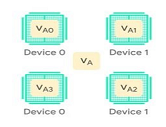

# Entrenamiento-distribuido-de-Redes-Neuronales-
Implementacion de la librería tf.distribute.Strategy de TensorFlow.

tf.distribute.Strategy
 API para distribuir en múltiples GPU, CPU o TPU.
 
 
 
Pasos realizados:

1. Se carga el dataset MNIST.
2. Se prepocesa el dataset.
3. Se define un modelo secuencial distribuido.
4. Se define un modelo secuencial no distribuido mediante mirrored strategy.
5. Se compara el tiempo de ejecucion de realizar el entrenamiento distribuido vs el no distribuido.
6. Se valida el modelo.

 
 
 

Conclusión: Se obtiene una reduccion en el tiempo de entrenar un modelo de manera distribuida.
Hardware utilizado: (Intel(R) Core(TM) i5-8250U CPU @ 1.80GHz)(8)

